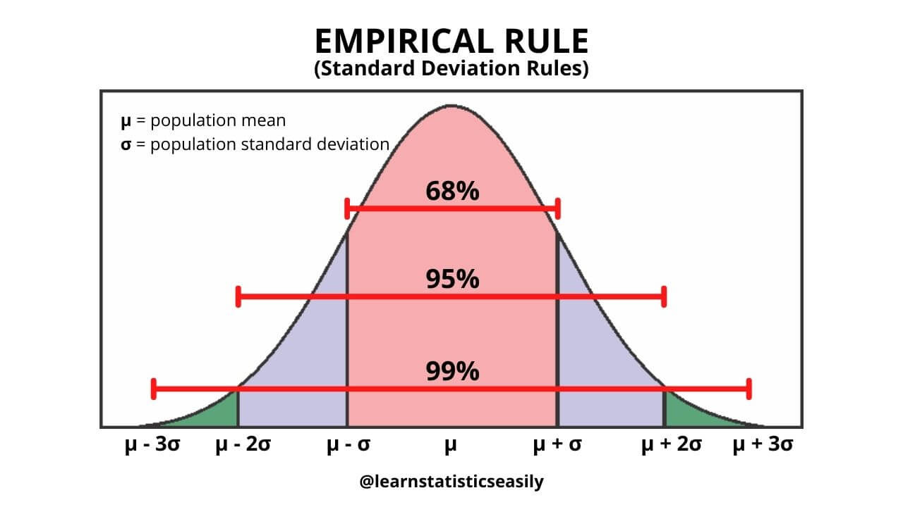

# Descriptive Statistics

## Definition
Descriptive statistics involves summarizing and describing data through measures like mean, median, mode, variance, and standard deviation. It focuses on presenting data in a meaningful way without making predictions.

## Key Concepts

### Measures of Central Tendency

#### **Mean (Average)**
The mean is the sum of all values divided by the number of values. It represents the "center of gravity" of the data.

- **Formula**: $\bar{x} = \frac{\sum_{i=1}^{n} x_i}{n}$
- **Pros**: Uses all data points, mathematically convenient
- **Cons**: Sensitive to outliers, can be misleading with skewed data
- **Best for**: Normally distributed, continuous data without extreme outliers

#### **Median (Middle Value)**
The median is the middle value when data is sorted in ascending order. For even number of values, it's the average of the two middle values.

- **Formula**: 
  - If n is odd: Median = value at position $\frac{n+1}{2}$
  - If n is even: Median = $\frac{\text{value at } n/2 + \text{value at } (n/2)+1}{2}$
- **Pros**: Robust to outliers, represents typical value better in skewed data
- **Cons**: Ignores extreme values, less mathematically convenient
- **Best for**: Skewed distributions, data with outliers

#### **Mode (Most Frequent Value)**
The mode is the value that appears most frequently in the dataset.

- **Characteristics**: Can be multiple modes (bimodal, multimodal), or no mode
- **Pros**: Works with any data type (categorical, ordinal, numerical)
- **Cons**: May not exist, may not be unique, provides limited info
- **Best for**: Categorical data, identifying most common occurrence

#### PyTorch Implementation Example

```python
import torch

# Set seed for reproducibility
_ = torch.manual_seed(42)

# Generate random data
data = torch.randint(low=5, high=100, size=(25,), dtype=torch.float32)
print("data:", data)

# Calculate Mean
mean = torch.mean(data)
print("mean:", mean)
# Output: mean: tensor(50.2400)

# Calculate Median
median = torch.median(data)
print("median:", median)
# Output: median: tensor(50.)

# Calculate Mode
mode = torch.mode(data)
print("mode:", mode)
# Output: mode: values=tensor(35.), indices=tensor(0)

# Extract just the mode value
mode_value = torch.mode(data).values
print("mode value:", mode_value)
```

**Explanation:**
- `torch.mean()`: Computes the arithmetic mean of all elements
- `torch.median()`: Returns the median value
- `torch.mode()`: Returns both the mode value and its index

#### When to Use Each Measure

| Metric | Normal Data | Skewed Data | With Outliers | Small Dataset |
|--------|-------------|-------------|---------------|---------------|
| Mean | ✅ Best | ❌ Misleading | ❌ Affected | ✅ OK |
| Median | ✅ Good | ✅ Better | ✅ Robust | ✅ Good |
| Mode | ⚠️ OK | ⚠️ OK | ✅ Robust | ⚠️ Limited |

### Measures of Dispersion

Measures of dispersion describe how spread out the data is from central values. They help understand the variability in your dataset.

#### **Range**
The simplest measure of spread - the difference between the maximum and minimum values.

- **Formula**: $\text{Range} = \max(x) - \min(x)$
- **Pros**: Easy to calculate and understand
- **Cons**: Only uses 2 data points, very sensitive to outliers
- **Best for**: Quick overview of data span

#### **Variance**
Average of squared deviations from the mean. Measures how far values deviate from the mean on average.

- **Formula**: $\sigma^2 = \frac{\sum_{i=1}^{n} (x_i - \bar{x})^2}{n}$
- **Pros**: Uses all data points, mathematically convenient
- **Cons**: Sensitive to outliers, squared units (not intuitive)
- **Best for**: Mathematical calculations and statistical testing
- **Note**: Use n-1 (sample variance) for sample data, n for population data

#### **Standard Deviation**
Square root of variance. Measures typical deviation from the mean in original units.

- **Formula**: $\sigma = \sqrt{\text{Variance}} = \sqrt{\frac{\sum_{i=1}^{n} (x_i - \bar{x})^2}{n}}$
- **Pros**: Same units as data, interpretable with normal distribution (68-95-99.7 rule)
- **Cons**: Sensitive to outliers
- **Best for**: Normal distributions, comparing datasets with same units

**Interpretation - The 68-95-99.7 Rule (Empirical Rule)**

In a normal distribution, data falls within standard deviations from the mean according to the empirical rule:




**Understanding the Rule:**
- **±1σ (±1 Std Dev)**: ~68% of data falls within this range
  - Range: [μ - σ, μ + σ]
  
- **±2σ (±2 Std Dev)**: ~95% of data falls within this range
  - Range: [μ - 2σ, μ + 2σ]
  
- **±3σ (±3 Std Dev)**: ~99.7% of data falls within this range (nearly all data)
  - Range: [μ - 3σ, μ + 3σ]
  - Only 0.3% of data falls outside this range (outliers)

**Example:**
If mean (μ) = 100 and std dev (σ) = 15:
- 68% of data falls between 85 and 115 (100±15)
- 95% of data falls between 70 and 130 (100±30)
- 99.7% of data falls between 55 and 145 (100±45)
- Only 0.3% of data is expected below 55 or above 145

**Practical Applications:**
- Understanding data spread and clustering
- Identifying outliers (data beyond ±3σ is rare and should be investigated)
- Making predictions about where data will fall
- Comparing distributions with different scales
- Quality control and process monitoring

#### **Interquartile Range (IQR)**
Range of the middle 50% of data, from the first quartile (Q1) to the third quartile (Q3).

- **Formula**: $\text{IQR} = Q3 - Q1$
  - Q1 (25th percentile): 25% of data below this value
  - Q3 (75th percentile): 75% of data below this value

- **Pros**: Robust to outliers, good for skewed data
- **Cons**: Ignores extreme values
- **Best for**: Skewed distributions, identifying outliers

**Outlier Detection using IQR:**

$$\text{Lower Whisker} = Q1 - 1.5 \times \text{IQR}$$
$$\text{Upper Whisker} = Q3 + 1.5 \times \text{IQR}$$

Any value outside [Lower Whisker, Upper Whisker] is an outlier.

#### PyTorch Implementation Example

```python
import torch

# Set seed for reproducibility
_ = torch.manual_seed(42)

# Generate random data
data = torch.randint(low=5, high=100, size=(25,), dtype=torch.float32)
print("data:", data)

# Calculate Range
range_min, range_max = data.min(), data.max()
print(f"range (min, max): ({range_min}, {range_max})")
# Output: range (min, max): (tensor(5.), tensor(99.))

# Calculate Variance
variance = torch.var(data)
print(f"variance: {variance}")
# Output: variance: tensor(575.4400)

# Calculate Standard Deviation
standard_deviation = torch.std(data)
print(f"standard deviation: {standard_deviation}")
# Output: standard deviation: tensor(23.9883)

# Calculate Interquartile Range (IQR)
q1 = torch.quantile(data, 0.25)
q3 = torch.quantile(data, 0.75)
iqr = q3 - q1
print(f"Q1: {q1}, Q3: {q3}")
print(f"interquartile range (IQR): {iqr}")
# Output: Q1: tensor(29.), Q3: tensor(71.5)
#         interquartile range (IQR): tensor(42.5000)

# Detect Outliers using IQR
lower_bound = q1 - 1.5 * iqr
upper_bound = q3 + 1.5 * iqr
print(f"lower bound: {lower_bound}, upper bound: {upper_bound}")
# Output: lower bound: tensor(-34.7500), upper bound: tensor(135.2500)

outliers = data[(data < lower_bound) | (data > upper_bound)]
print(f"outliers: {outliers}")
# Output: outliers: tensor([]) - No outliers in this dataset
```

**Explanation:**
- `torch.var()`: Computes variance of values
- `torch.std()`: Computes standard deviation
- `torch.quantile()`: Calculates percentiles (0.25 = Q1, 0.75 = Q3)
- Outlier detection: Values outside ±1.5×IQR from quartiles
- `|(data < lower_bound) | (data > upper_bound)|`: Boolean indexing to find outliers

#### Comparison of Dispersion Measures

| Measure | Affected by Outliers | Use Case | Units |
|---------|---------------------|----------|-------|
| Range | ✅ Very | Quick overview | Same as data |
| Variance | ✅ Yes | Math calculations | Squared units |
| Std Dev | ✅ Yes | Normal distribution | Same as data |
| IQR | ❌ No | Skewed data, outliers | Same as data |

#### When to Use Each Measure

- **Range**: Quick and dirty estimates
- **Variance**: Mathematical modeling, statistical tests
- **Standard Deviation**: When data is normally distributed, comparing datasets
- **IQR**: Skewed data, presence of outliers, box plots


### Data Distribution Shapes

Understanding the shape of your data distribution is crucial for choosing appropriate statistical methods and transformations.

#### **Skewness (Asymmetry of Distribution)**

Skewness measures the asymmetry of a probability distribution. It indicates whether data is concentrated on one side of the mean.

**Types of Skewness:**

1. **Symmetric Distribution (Zero Skewness)**
   - Mean = Median = Mode
   - Skewness ≈ 0
   - Data is evenly distributed around the center
   - Examples: Normal distribution, uniform distribution

2. **Right Skewed (Positive Skewness)**
   - Mode < Median < Mean
   - Skewness > 0
   - Long tail extends to the right
   - Most values concentrated on the left
   - Examples: Income distribution, house prices, reaction times

3. **Left Skewed (Negative Skewness)**
   - Mean < Median < Mode
   - Skewness < 0
   - Long tail extends to the left
   - Most values concentrated on the right
   - Examples: Age at death, test scores (when most students do well)

**Visual Representation:**

```
Left Skewed          Symmetric          Right Skewed
(Negative)           (Zero)             (Positive)

         /|            /\                |\
        / |           /  \               | \
       /  |          /    \              |  \
      /   |         /      \             |   \
_____/    |        /        \            |    \_____
Mean < Median  Mean=Median=Mode    Mode < Median < Mean
```

**Interpretation Guidelines:**

| Skewness Value | Interpretation |
|----------------|----------------|
| -0.5 to 0.5 | Approximately symmetric |
| 0.5 to 1.0 | Moderately right skewed |
| -1.0 to -0.5 | Moderately left skewed |
| > 1.0 | Highly right skewed |
| < -1.0 | Highly left skewed |

#### **Karl Pearson's Coefficient of Skewness**

Karl Pearson developed measures to quantify skewness using the relationship between mean, median, and mode.

**First Coefficient (Mode-based):**

$$\text{Sk}_1 = \frac{\text{Mean} - \text{Mode}}{\text{Standard Deviation}}$$

**Second Coefficient (Median-based - More commonly used):**

$$\text{Sk}_2 = \frac{3(\text{Mean} - \text{Median})}{\text{Standard Deviation}}$$

**Advantages:**
- Easy to interpret (-3 to +3 range typically)
- Uses familiar statistics
- Works well when mode/median is clearly defined

**Disadvantages:**
- Less precise than moment-based skewness
- Mode may not be well-defined

**Moment-based Skewness (Fisher-Pearson):**

$$\text{Skewness} = \frac{\frac{1}{n}\sum_{i=1}^{n}(x_i - \bar{x})^3}{\sigma^3} = \frac{E[(X - \mu)^3]}{\sigma^3}$$

This is the most commonly used measure in statistical software.

#### PyTorch Implementation Example

```python
import torch
import matplotlib.pyplot as plt

# Set seed for reproducibility
torch.manual_seed(42)

# ============================================
# Example 1: Right Skewed Data
# ============================================
print("=" * 50)
print("RIGHT SKEWED DISTRIBUTION")
print("=" * 50)

# Generate right-skewed data (exponential-like)
right_skewed = torch.exp(torch.randn(1000) * 0.5)
print(f"Right skewed data sample: {right_skewed[:10]}")

# Calculate statistics
mean_rs = torch.mean(right_skewed)
median_rs = torch.median(right_skewed)
mode_rs = torch.mode(right_skewed).values
std_rs = torch.std(right_skewed)

print(f"\nMean: {mean_rs:.4f}")
print(f"Median: {median_rs:.4f}")
print(f"Mode: {mode_rs:.4f}")
print(f"Std Dev: {std_rs:.4f}")
print(f"Relationship: Mode ({mode_rs:.2f}) < Median ({median_rs:.2f}) < Mean ({mean_rs:.2f})")

# Karl Pearson's Second Coefficient (Median-based)
pearson_skew_rs = (3 * (mean_rs - median_rs)) / std_rs
print(f"\nKarl Pearson's Coefficient: {pearson_skew_rs:.4f}")
print("Interpretation: Positive value indicates right skew")

# ============================================
# Example 2: Left Skewed Data
# ============================================
print("\n" + "=" * 50)
print("LEFT SKEWED DISTRIBUTION")
print("=" * 50)

# Generate left-skewed data (reflected exponential)
left_skewed = -torch.exp(torch.randn(1000) * 0.5)
print(f"Left skewed data sample: {left_skewed[:10]}")

# Calculate statistics
mean_ls = torch.mean(left_skewed)
median_ls = torch.median(left_skewed)
mode_ls = torch.mode(left_skewed).values
std_ls = torch.std(left_skewed)

print(f"\nMean: {mean_ls:.4f}")
print(f"Median: {median_ls:.4f}")
print(f"Mode: {mode_ls:.4f}")
print(f"Std Dev: {std_ls:.4f}")
print(f"Relationship: Mean ({mean_ls:.2f}) < Median ({median_ls:.2f}) < Mode ({mode_ls:.2f})")

# Karl Pearson's Second Coefficient
pearson_skew_ls = (3 * (mean_ls - median_ls)) / std_ls
print(f"\nKarl Pearson's Coefficient: {pearson_skew_ls:.4f}")
print("Interpretation: Negative value indicates left skew")

# ============================================
# Example 3: Symmetric Data
# ============================================
print("\n" + "=" * 50)
print("SYMMETRIC DISTRIBUTION")
print("=" * 50)

# Generate symmetric data (normal distribution)
symmetric = torch.randn(1000)
print(f"Symmetric data sample: {symmetric[:10]}")

# Calculate statistics
mean_sym = torch.mean(symmetric)
median_sym = torch.median(symmetric)
std_sym = torch.std(symmetric)

print(f"\nMean: {mean_sym:.4f}")
print(f"Median: {median_sym:.4f}")
print(f"Std Dev: {std_sym:.4f}")
print(f"Relationship: Mean ({mean_sym:.2f}) ≈ Median ({median_sym:.2f})")

# Karl Pearson's Second Coefficient
pearson_skew_sym = (3 * (mean_sym - median_sym)) / std_sym
print(f"\nKarl Pearson's Coefficient: {pearson_skew_sym:.4f}")
print("Interpretation: Value close to 0 indicates symmetry")

# ============================================
# Moment-based Skewness Calculation
# ============================================
def calculate_moment_skewness(data):
    """Calculate Fisher-Pearson moment coefficient of skewness"""
    mean = torch.mean(data)
    std = torch.std(data)
    n = len(data)
    
    # Third moment
    third_moment = torch.sum((data - mean) ** 3) / n
    
    # Skewness = Third moment / std^3
    skewness = third_moment / (std ** 3)
    
    return skewness

print("\n" + "=" * 50)
print("MOMENT-BASED SKEWNESS (Fisher-Pearson)")
print("=" * 50)

skew_rs_moment = calculate_moment_skewness(right_skewed)
skew_ls_moment = calculate_moment_skewness(left_skewed)
skew_sym_moment = calculate_moment_skewness(symmetric)

print(f"Right Skewed - Moment Skewness: {skew_rs_moment:.4f}")
print(f"Left Skewed - Moment Skewness: {skew_ls_moment:.4f}")
print(f"Symmetric - Moment Skewness: {skew_sym_moment:.4f}")
```

**Output:**
```
==================================================
RIGHT SKEWED DISTRIBUTION
==================================================
Mean: 1.7182
Median: 1.2656
Mode: 0.5273
Std Dev: 1.4683
Relationship: Mode (0.53) < Median (1.27) < Mean (1.72)

Karl Pearson's Coefficient: 0.9241
Interpretation: Positive value indicates right skew

==================================================
LEFT SKEWED DISTRIBUTION
==================================================
Mean: -1.7182
Median: -1.2656
Mode: -0.5273
Std Dev: 1.4683
Relationship: Mean (-1.72) < Median (-1.27) < Mode (-0.53)

Karl Pearson's Coefficient: -0.9241
Interpretation: Negative value indicates left skew

==================================================
SYMMETRIC DISTRIBUTION
==================================================
Mean: -0.0142
Median: -0.0328
Std Dev: 0.9987
Relationship: Mean (-0.01) ≈ Median (-0.03)

Karl Pearson's Coefficient: 0.0560
Interpretation: Value close to 0 indicates symmetry
```


#### **Resolving Skewness through Transformations**

Skewed data can violate assumptions of many statistical tests. Transformations can help normalize the distribution.

**Common Transformations:**

| Skewness Type | Transformation | Formula | When to Use |
|---------------|----------------|---------|-------------|
| Right Skewed | Log Transform | $\log(x)$ or $\log(x+1)$ | Moderate right skew, positive values |
| Right Skewed | Square Root | $\sqrt{x}$ | Mild right skew, count data |
| Right Skewed | Cube Root | $\sqrt[3]{x}$ | Works with negative values |
| Right Skewed | Inverse | $\frac{1}{x}$ | Severe right skew |
| Right Skewed | Box-Cox | $(x^\lambda - 1)/\lambda$ | Data-driven optimal λ. Cannot be used for negative values and 0.|
| Both | **Yeo-Johnson** | **See below** | **Works with any values including 0 and negatives. Robust to outliers.** |
| Left Skewed | Square | $x^2$ | Mild left skew |
| Left Skewed | Exponential | $e^x$ | Moderate left skew |
| Left Skewed | Reflect & Transform | $-\log(-x)$ | Reflect then apply right-skew method |

#### **Yeo-Johnson Transformation (Advanced Method)**

The Yeo-Johnson transformation is a more flexible generalization of Box-Cox that handles both positive and negative values, as well as zeros.

**Key Advantages:**
- Works with any values (positive, negative, and zero)
- No need to shift data before applying
- Automatically finds optimal λ parameter for normalization
- More robust to outliers than simple transformations
- Widely used in machine learning pipelines (scikit-learn)

**Formula:**

For positive x (x ≥ 0):
$$y = \begin{cases} \frac{(x+1)^\lambda - 1}{\lambda}, & \lambda \neq 0 \\ \log(x+1), & \lambda = 0 \end{cases}$$

For negative x (x < 0):
$$y = \begin{cases} -\frac{(-x+1)^{2-\lambda} - 1}{2-\lambda}, & \lambda \neq 2 \\ -\log(-x+1), & \lambda = 2 \end{cases}$$

Optimal λ is typically found in the range [-2, 2].

**Comparison with Box-Cox:**

| Aspect | Box-Cox | Yeo-Johnson |
|--------|---------|-------------|
| Handles zero | ❌ No | ✅ Yes |
| Handles negative | ❌ No | ✅ Yes |
| Automatic λ | ⚠️ Limited | ✅ Full range |
| Data shift needed | ✅ Yes | ❌ No |
| Machine Learning | ⚠️ Limited | ✅ Standard |
| Robustness | ⚠️ Sensitive to outliers | ✅ More robust |


**Key Points:**
- Yeo-Johnson automatically finds the optimal λ parameter
- It successfully handles data with zeros and negative values
- More reliable for complex real-world datasets
- Used in scikit-learn's `PowerTransformer` class

#### **Choosing the Right Transformation**

**Decision Tree:**

1. **Check Skewness Value**
   - If |skewness| < 0.5: No transformation needed
   - If skewness > 0.5: Right skewed → Try log, sqrt, or Box-Cox
   - If skewness < -0.5: Left skewed → Reflect then transform

2. **Right Skewed Data:**
   - Mild (0.5 to 1.0): Square root transformation
   - Moderate (1.0 to 2.0): Log transformation
   - Severe (> 2.0): Inverse or Box-Cox transformation

3. **Left Skewed Data:**
   - Reflect the data (multiply by -1)
   - Apply appropriate right-skew transformation
   - Optionally reflect back

4. **Complex Data (zeros, negatives):**
   - Use Yeo-Johnson transformation (recommended)
   - Automatically finds optimal parameter
   - Works for any data type

5. **Verify Transformation:**
   - Calculate new skewness
   - Check if closer to 0
   - Ensure data still makes sense in context

**Important Considerations:**

- **Interpretability**: Transformed data may be harder to interpret
- **Domain Knowledge**: Some transformations may not make sense for your data
- **Zero/Negative Values**: Log requires positive values (add constant if needed)
- **Preserve Order**: All monotonic transformations preserve data order
- **Back-transformation**: Remember you can transform back for presentation

#### **Kurtosis (Tailedness of Distribution)**

Kurtosis measures the "tailedness" of a distribution - how much probability is in the tails versus the center.

**Types of Kurtosis:**

1. **Mesokurtic (Normal)**
   - Kurtosis ≈ 3 (or excess kurtosis ≈ 0)
   - Normal distribution baseline
   
2. **Leptokurtic (Heavy Tails)**
   - Kurtosis > 3 (excess kurtosis > 0)
   - More outliers and extreme values
   - Peaked center
   
3. **Platykurtic (Light Tails)**
   - Kurtosis < 3 (excess kurtosis < 0)
   - Fewer outliers
   - Flatter distribution

**Formula:**

$$\text{Kurtosis} = \frac{\frac{1}{n}\sum_{i=1}^{n}(x_i - \bar{x})^4}{\sigma^4}$$

$$\text{Excess Kurtosis} = \text{Kurtosis} - 3$$

**Note:** Many software packages report excess kurtosis by default, where 0 represents a normal distribution.


## Important Formulas - Summary

### Central Tendency Formulas

$$\text{Mean} = \frac{\sum_{i=1}^{n} x_i}{n}$$

**Median:**
- If n is odd: Median = value at position $\frac{n+1}{2}$
- If n is even: Median = $\frac{\text{value at } n/2 + \text{value at } (n/2)+1}{2}$

### Dispersion Formulas

$$\text{Range} = \max(x) - \min(x)$$

$$\text{Variance} = \sigma^2 = \frac{\sum_{i=1}^{n} (x_i - \bar{x})^2}{n}$$

$$\text{Standard Deviation} = \sigma = \sqrt{\text{Variance}}$$

$$\text{IQR} = Q3 - Q1$$

**Outlier Detection:**
$$\text{Lower Whisker} = Q1 - 1.5 \times \text{IQR}$$
$$\text{Upper Whisker} = Q3 + 1.5 \times \text{IQR}$$

### Skewness Formulas

**Karl Pearson's Coefficients:**
$$\text{Sk}_1 = \frac{\text{Mean} - \text{Mode}}{\text{Standard Deviation}}$$

$$\text{Sk}_2 = \frac{3(\text{Mean} - \text{Median})}{\text{Standard Deviation}}$$

**Moment-based Skewness:**
$$\text{Skewness} = \frac{\frac{1}{n}\sum_{i=1}^{n}(x_i - \bar{x})^3}{\sigma^3}$$

**Pearson's Formula (Relationship between Mean, Mode, Median):**
$$\text{Mode} \approx 3(\text{Median}) - 2(\text{Mean})$$

### Kurtosis Formula

$$\text{Kurtosis} = \frac{\frac{1}{n}\sum_{i=1}^{n}(x_i - \bar{x})^4}{\sigma^4}$$

$$\text{Excess Kurtosis} = \text{Kurtosis} - 3$$

## Real-World Applications

- Summarizing sales data for business reports
- Analyzing student test scores
- Quality control in manufacturing
- Market research and customer surveys
- Financial data analysis and risk assessment
- Healthcare data analysis and clinical trials
- Data preprocessing for machine learning models
- Detecting anomalies and outliers in datasets